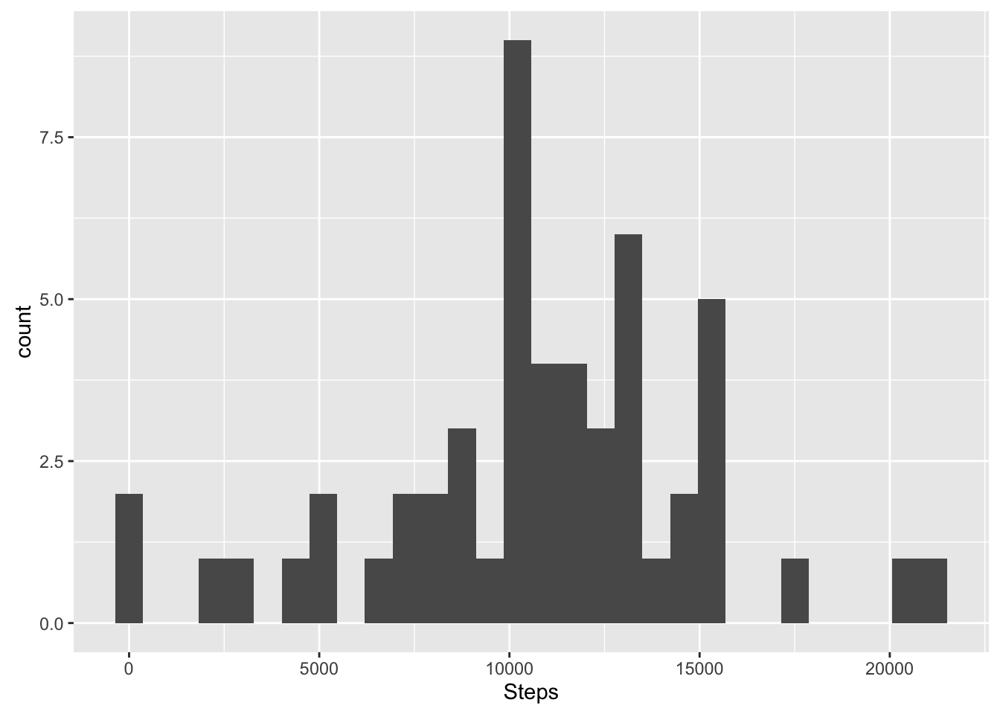
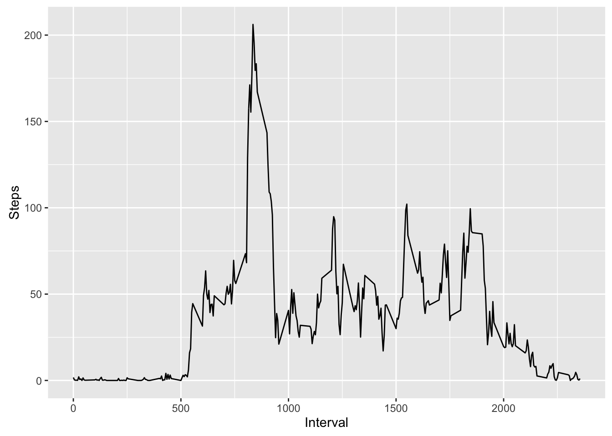
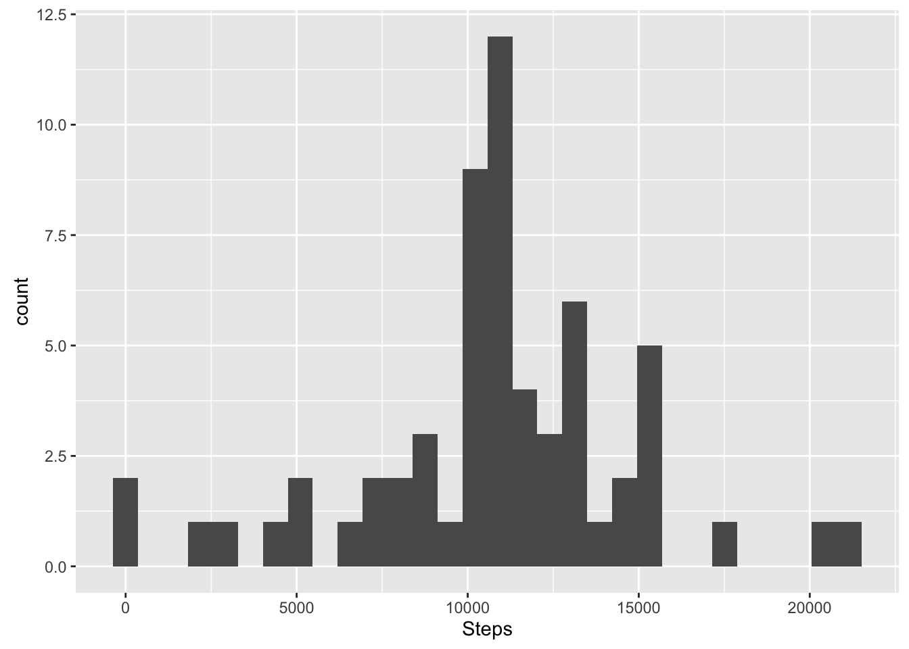
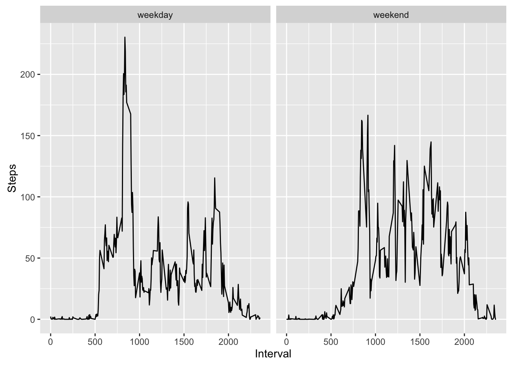

### Loading and preprocessing the data

```{r}
  library(ggplot2);
  activity <- read.csv("activity.csv");
  activity$date<-as.Date(activity$date, format="%Y-%m-%d");
  day <- with(activity, aggregate(steps, by=list(date), FUN=sum));
  colnames(day) <- c("Date", "Steps");
  day$isWeekDay <- weekdays(day$Date) %in% c("Monday", "Tuesday", "Wednesday", "Thursday", "Friday");
```

### What is the mean total number of steps taken per day?

```{r}
  qplot(Steps, data=day);
```



### Calculate and report the mean and median of the total number of steps taken per day

```{r}
  ave <- mean(day$Steps, na.rm=TRUE);
  ave;
  med <- median(day$Steps, na.rm=TRUE)
  med;
```

The average is 10766.19.  
The median is 10765.

### What is the average daily activity pattern?

```{r}
  interval <- with(activity, aggregate(steps, by=list(interval), FUN=mean, na.rm=TRUE));
  colnames(interval) <- c("Interval", "Steps");
  qplot(Interval, Steps, data=interval, geom="line")
```



### Inputting missing values

For each missing value, fill it in with the mean for that 5-minute interval.

```{r}
  library(plyr);
  completed <- ddply(activity, .(interval), transform, mean=mean(steps, na.rm=TRUE));
  missingrows <- which(is.na(completed$steps));
  completed[missingrows,]$steps <- completed[missingrows,]$mean;
  
  completeDay <- with(completed, aggregate(steps, by=list(date), FUN=sum, na.rm=TRUE));
  colnames(completeDay) <- c("Date", "Steps");
  completeAve <- mean(completeDay$Steps, na.rm=TRUE);
  completeAve
  completeMed <- median(completeDay$Steps, na.rm=TRUE);
  completeMed
  qplot(Steps, data=completeDay)
```



The completed average is 10766.19.  
The completed median is 10766.19.

1. **Do these values differ from the estimates from the first part of the assignment?**

    The average did not change, the median increased a negligible amount.

2. **What is the impact of imputing missing data on the estimates of the total daily number of steps?**
 
    There was no change.
    
### Are there difference in activity patterns between weekdays and weekends?

```{r}
  completed$isWeekDay <- weekdays(completed$date) %in% c("Monday", "Tuesday", "Wednesday", "Thursday", "Friday");
  completed$dayType <- ifelse(completed$isWeekDay, "weekday", "weekend");
  
  completedInt <- with(completed, aggregate(steps, by=list(interval,dayType), FUN=mean, na.rm=TRUE));
  colnames(completedInt) <- c("Interval", "dayType", "Steps");
  qplot(Interval, Steps, data=completedInt, geom="line", facets=.~dayType)
```

